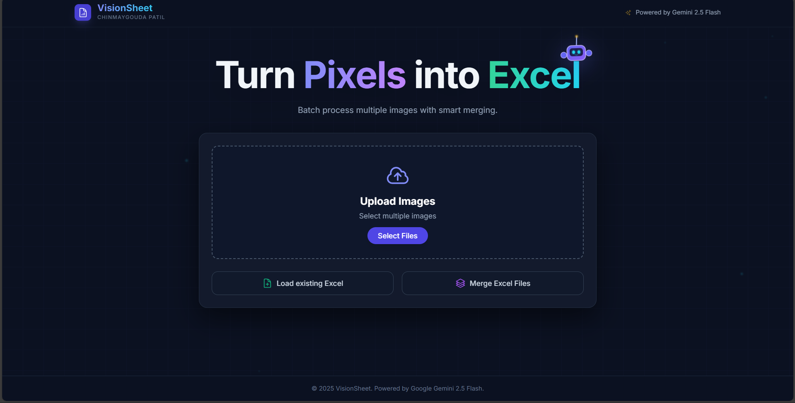

<div align="center">

</div>

# 👁️ VisionSheet

> **Turn messy photos into clean, professional Excel spreadsheets instantly.**

VisionSheet is an AI-powered workspace that transforms handwritten notes, receipts, and whiteboard photos into structured Excel files. It features **batch processing**, **smart table merging**, and **existing Excel integration**, powered by Google's Gemini 1.5 Flash.


*(The interface features a 3D interactive robot and real-time processing status)*

---

## 🚀 Key Features

### 🤖 AI Vision Core
- **Powered by Gemini 1.5 Flash:** Accurately reads complex table structures, handwriting, and mixed formats.
- **Auto-Correction:** Automatically detects data types (Numbers vs Text) to ensure Excel formulas work immediately.

### ⚡ Batch Processing & Smart Merge
- **Multi-Image Upload:** Upload 10+ images at once.
- **Smart Logic:**
  - *Vertical Merge:* If columns match, it stacks data automatically.
  - *Horizontal Merge:* If columns differ, it places tables side-by-side with visual separators.

### 📊 Excel Integration
- **Import Existing Files:** Load an `.xlsx` file and append new data from images directly to it.
- **Pro Styling:** Exports files with professional headers, auto-filters, zebra striping, and auto-adjusted column widths.

### 🛡️ Enterprise-Grade Security
- **Backend Proxy:** API keys are secured server-side (Python); never exposed to the client.
- **Rate Limiting:** IP-based quotas prevent abuse (5 requests/day limit per user).
- **Privacy:** No data is stored permanently; images are processed in-memory.

---

## 🛠️ Tech Stack

| Component | Technology | Description |
| :--- | :--- | :--- |
| **Frontend** | **React (Vite)** | Fast, responsive UI with TypeScript |
| **Styling** | **TailwindCSS** | Modern, dark-mode design with Framer Motion animations |
| **Backend** | **Python (Flask)** | Secure proxy server and logic handler |
| **AI Model** | **Google Gemini 1.5** | Multimodal vision and data extraction |
| **Deployment** | **Google Cloud Run** | Serverless containerization |

---

## 📦 How to Run Locally

Follow these steps to run VisionSheet on your machine.

### 1. Prerequisites
- Node.js & npm installed
- Python 3.9+ installed
- A [Google AI Studio API Key](https://aistudio.google.com/)

### 2. Backend Setup (Python)
The backend handles security and AI communication.

```bash
# Clone the repository
git clone https://github.com/Chinmaygouda/VisionSheet.git
cd VisionSheet

# Create virtual environment
python -m venv venv
# Windows: venv\Scripts\activate
# Mac/Linux: source venv/bin/activate

# Install dependencies
pip install -r requirements.txt

# Create .env file for security
# (Create a file named .env in the root folder and add your key)
echo "GOOGLE_API_KEY=your_actual_api_key_here" > .env

# Run the server
python app.py
Server runs on: http://127.0.0.1:5000

### 3. Frontend Setup (React)
Open a new terminal window.
cd templates

# Install dependencies
npm install

# Start the UI
npm run dev

Frontend runs on: http://localhost:5173

### ☁️ Deployment Architecture
VisionSheet uses a dual-deployment strategy for security and scalability.
1. Google Cloud Run (Monolith)
Used for the Google Scaler Competition.
A Dockerfile builds the React frontend and serves it via Flask static files.
Creates a single, scalable container managed by Google's infrastructure.
2. Vercel + Render (Public)
Used for Public Access.
Frontend: Hosted on Vercel (Global CDN).
Backend: Hosted on Render (Secure container).
Security: app.py enforces CORS and Rate Limiting.

### 👥 Authors & Credits

Built for the Google AI Studio × Scaler Startup Competition 2025.

**Team:**
- Chinmaygouda Patil – Full Stack Developer & AI Integration  
- **Davana Hiremath H S (@Davanahs) – Product Strategy, UX Research & Community Outreach**


Goal: To demonstrate the power of Multimodal AI in automating complex data entry workflows.
